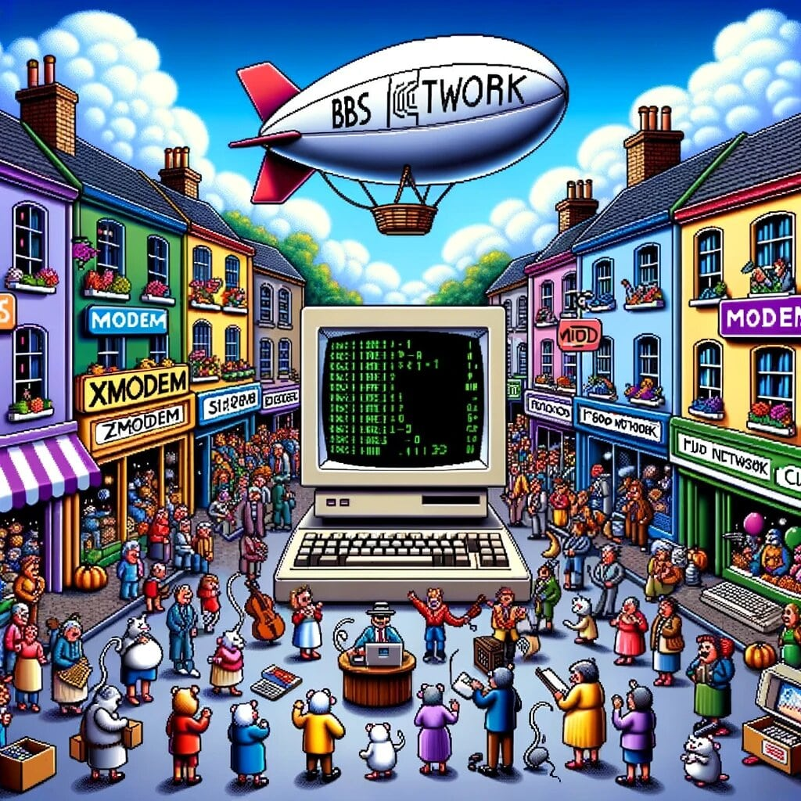

# EightiesBox


## Overview

EightiesBox is an ASCII/ANSI-based web platform that mimics the vintage mailbox BBSes from the 1980s. Utilizing a JavaScript frontend powered by Phaser, a 2D game engine that employs WebGL for speedy performance, EightiesBox offers a nostalgic interface for modern web browsers.

## Usage

The login screen, reminiscent of classic Bulletin Board Systems (BBS), embodies the nostalgia and simplicity of early computing days. BBS systems often had minimalistic design interfaces, largely due to the technical constraints of the era. ASCII art, colored text, and blocky characters were the aesthetics of the day, and this interface has captured that essence well.

In original BBS systems, the input field served as a primary method of user interaction. It was crucial because it was typically the user's gateway to the system. The text-based interface relied heavily on a user's typed commands, often requiring specific syntax or commands to navigate or perform actions. This starkly contrasts with the graphical user interfaces of today's web, where mouse movements and clickable icons dominate.

# Welcome to the Global BBS Gateway!

## Explore and Connect:
- **Navigate through a curated collection of Bulletin Board Systems (BBS)**, including the renowned Eightiesbox Headquarters and many more!
- Use the up (`<`) and down (`>`) arrow keys on your keyboard to effortlessly browse through the list of available BBSes.

## Select and Dive In:
- Once you've highlighted your desired BBS, simply press `ENTER` to initiate your journey into the selected community.

## Create Your Own Realm:
- Feeling creative? Press `C` to embark on the exciting adventure of crafting your own BBS!
- After pressing `C`, type in the name of your new, personal BBS and press `ENTER`. Watch as your vision comes to life!

# Login


Navigate to the "Please enter your name:" prompt.
Type in your desired username or handle.
Press the ENTER key to confirm.
In the subsequent step, you'll likely be prompted to enter and confirm your password. Ensure you remember it, as it will be your secure access key to this system

### Oneliners


Oneliners, though simple in concept, were the heartbeat of many BBS systems. They gave a quick snapshot of the community's vibe and encouraged playful and spontaneous interactions among users. So go ahead, leave your mark, and enjoy the camaraderie of the BBS world!

To add an oneliner to this BBS:

At the prompt "Do you want to add a new oneliner? (Y/N)", type 'Y' for Yes.
You'll likely be presented with a new prompt or a blank line awaiting your input.
Type in your oneliner - remember to keep it concise!
Press the ENTER key to post your oneliner to the board.

## BBS Menu Options


### 1. **Message base area change** `[A]`

- Switch between different message boards or forums within the BBS.
- Each "area" can focus on a specific topic, from general discussions to specialized subjects.

### 2. **Read messages** `[R]`

- Browse and read posts left by other users in the current message area.
- Engage with the content and participate in discussions.

### 3. **Write messages** `[W]`

- Contribute to a conversation or start a new thread.
- An editor will likely be presented for users to type and post their message.

### 4. **Who is online** `[?]`

- View a real-time list of users currently logged into the BBS.
- See who else is active, their username, current activity, and online duration.

### 5. **Chat between lines** `[C]`

- Real-time chat feature.
- Engage in direct conversations with others online, either in public chat rooms or through private messages.

### 6. **Setup message areas** `[1]`

- Administrative function to configure, add, or remove message areas.
- Ensure discussions remain categorized and are easy to navigate.

### 7. **ANSI editor** `[3]`

- A specialized text editor for creating or editing messages with ANSI art and formatting.
- Produce colorful and graphical renditions in text mode, adding creativity to posts or designing vibrant BBS screens.

When composing a new message or initiating a chat, if you enter an incorrect username, a list of users will be displayed. You can navigate through this list using the cursor keys or the > and < buttons on the onscreen keyboard. Occasionally, pressing ESC may be necessary to access the menu bar for navigation, especially when writing a new message or working within the ANSI editor.

## BBS System Overview & Technical Features

- **Technologies Used**: Socket.io, MongoDB, Phaser
- **ANSI Parser**: Modified version of `stransi`
- **Responsive Canvas**: Different canvas sizes based on screen width

## Canvas Sizing

| Screen Width | Canvas Size (x, y) |
| ------------ | ------------------ |
| < 640px      | 40 x 25            |
| < 1280p      | 80 x 50            |
| >= 1280px    | 120 x 60           |

## Features

- User login and registration through `userregistration.py`.
  
- One-liners input capability via `oneliners.py`.
  
- Ability to display ANSI files located in the `ansi` directory.
  

## Architecture

### Client Side

- `client.js`: Handles Socket.io parsing.
- `main.js`: Responsible for initializing the Phaser canvas.

### Server Side

- `app.py`: Orchestrates the application's core logic.
- `sessiondata.py`: Contains the `SessionData` class to manage user sessions.

#### Session Management Example

```python
def on_new_connection():
    request_sid = request.sid
    sid_data[request_sid] = SessionData()

def on_connection_close():
    request_sid = request.sid
    if request_sid in sid_data:
        del sid_data[request_sid]
```

The `SessionData` class contains fields for managing session-specific actions. Multiple tabs can be opened, each having a separate session.

## Installation & Setup

### Requirements

- Python 3.x

On Linux Python is pre-installed, on Windows you must make sure to download the correct installer

### Installation

1. Clone the repository.
2. Install the required Python packages:

```bash
pip install ochre flask pymongo flask_socketio bcrypt google-auth google-auth-oauthlib google-auth-httplib2 google-api-python-client google-cloud-storage google-cloud-pubsub email_validator
```

(Install any other missing packages as needed.)

# MongoDB Installation

## Windows

1. **Download MongoDB**

   - Navigate to [MongoDB Community Download Page](https://www.mongodb.com/try/download/community).
   - Download the installer suitable for your Windows version.

2. **Installation**

   - Run the installer.
   - When prompted, choose to install MongoDB **without setting it up as a service**.

3. **Create Data Directory**

   - Open the Command Prompt as an administrator.
   - Run the following command to create a directory for MongoDB to store its data:
     ```
     mkdir C:\data
     ```

4. **Run MongoDB**
   - Navigate to the `bin` folder where `mongod.exe` is located, typically `C:\Program Files\MongoDB\Server\[version]\bin\`.
   - Run `mongod.exe`.

## macOS

1. **Download MongoDB**

   - Visit [MongoDB Community Download Page](https://www.mongodb.com/try/download/community).
   - Download the TGZ file.

2. **Installation**

   - Open the Terminal.
   - Extract the downloaded TGZ file.
   - Move the extracted files to the desired installation directory, e.g., `/usr/local/mongodb`.

3. **Create Data Directory**

   - In the Terminal, run:
     ```
     mkdir -p /data/db
     ```

4. **Run MongoDB**
   - Navigate to the `bin` folder inside your MongoDB installation directory.
   - Run `./mongod`.

## Linux (Ubuntu)

1. **Download MongoDB**

   This are the instructions for Ubuntu 22

   - Open Terminal.
     Run:

   ```
   wget https://repo.mongodb.org/apt/ubuntu/dists/jammy/mongodb-org/6.0/multiverse/binary-amd64/mongodb-org-server_6.0.11_amd64.deb
   ```

2. **Install the deb package**

   Run:

   ```
   sudo dpkg -i mongodb-org_6.0.x_amd64.deb
   ```

3. **Create Data Directory**

   - Run:
     ```
     sudo mkdir -p /data/db
     ```

4. **Run MongoDB**

   - Navigate to the `/usr/bin` folder
   - Start the application `mongod`

5. **Permissions**

   If it still does not work, make sure the directory has got the correct permissions

   - Run:

   ```
   sudo chown -R mongodb:mongodb /data/db
   ```

   Replace mongodb:mongodb with your username

# Quickstart

Call

python app.py

Open the page using http://localhost:5000

Make sure to have downloaded the json file from Google Cloud Storage with an account:

1. Go to the Google Cloud Console:

Navigate to the Google Cloud Console.

2. Select your project:

From the project drop-down, select your project that the service account belongs to.

3. Navigate to IAM & Admin:

On the navigation menu, click on "IAM & Admin", then select "Service accounts".

4. Find your service account:

Locate the service account for which you want to download the key, and click on the email address associated with it.

5. Create new key:

Click on the "Keys" tab, then click on "Add Key" and select "JSON" to create a new key.

6. Download the key:

The key will be generated and downloaded to your machine automatically.

Set the GOOGLE_APPLICATION_CREDENTIALS in your environment variables.

Windows:

Right-click on 'This PC' or 'My Computer' on your desktop or in File Explorer, and select 'Properties.'
Click on 'Advanced system settings.'
Click on the 'Environment Variables' button.
In the 'System variables' section, click 'New' and enter GOOGLE_APPLICATION_CREDENTIALS for the name and the path to the key file for the value.

Linux:

To make this environment variable available in all future terminal sessions, you can add the export command to your shell’s profile or configuration file.
For bash, you can add it to ~/.bashrc or ~/.bash_profile.
For zsh, you can add it to ~/.zshrc.
Open the file in a text editor and add the following line:

```
export GOOGLE_APPLICATION_CREDENTIALS=/path/to/your/keyfile.json
```
Save the file and source it to apply the changes:
```
source ~/.bashrc  # or the name of the file you edited
```

Make sure to replace path\to\your\keyfile.json or /path/to/your/keyfile.json with the actual path to your key file.

# Disabling Google Cloud Storage

Alternatively, if you don't want to sign up at Google for a Google Cloud Storage key, comment out these lines in app.py:

```
# Initialize Google Cloud
storage_client = storage.Client()
bucket = storage_client.get_bucket('eightiesbox')

# Initialize Pub/Sub client
subscriber = pubsub_v1.SubscriberClient()
subscription_path = subscriber.subscription_path('animated-moon-403620', 'projects/animated-moon-403620/subscriptions/bbs-file-upload-notification')
```

This will make it possible to run the application without a file base.

# Troubleshooting issues

Using Gunicorn you might be facing timeout issues with Socket.IO calls. The issue might be stemming from the fact that Gunicorn, as a WSGI server, does not natively support long-lived connections like WebSockets, which are used by Socket.IO.

```
pip install eventlet
```

Then on your linux server call:
```
sudo GOOGLE_APPLICATION_CREDENTIALS=~/eightiesbox/animated-moon-403620-a91bc66243a8.json gunicorn -k eventlet -w 1 --bind 0.0.0.0:80 app:app
```

# BBS Sysop Guide

## Accessing the BBS

- **URL**: Open your web browser and navigate to [http://localhost:5000](http://localhost:5000).
- **Registration**: Register an account using the username `sysop` and set a secure password.

## Start Page and Resolution

- The start page you see is located in the `ansi` directory.
- The layout can differ based on your screen resolution. It's advisable to use a high-resolution display for optimal sysop (admin) settings.

## Menu Editor

After the initial oneliners, you'll be prompted to navigate to the menu editor. Here's how you can manage it:

### Creating a Menu

- Navigate through options using the cursor keys and press `Enter` to create a menu.

#### Type

1. Press `Enter` to modify this field.
2. A popup will appear; navigate using cursor keys.
3. Press `Enter` to access the submenu that opens to the right.
4. Choose an option, for example, "Goto menu".

- Note: A number, like 01, 02, 03, etc., will populate the 'Type' field.

### Editing the ANSI

- Press `ESC` or cursor up to reveal the menu bar.
- Navigate to "Edit" using the cursor keys and select "Edit Text" to enter the ANSI editor for the current menu.
- Insert text as desired.
- Press `ESC` and navigate to `File -> Leave ANSI Editor` to return to the menu editor.

#### Saving ANSI

- ANSI files can be saved via `File -> Save as ANSI file`.

### Saving the Menu

1. Press `ESC` to reveal the menu bar.
2. Navigate using the cursor keys to the 'Save' option.
3. Enter a filename, recommended: `MAIN.MNU`.

- This will be the main menu displayed to every user upon login.

### Additional Fields

- You can add more fields by utilizing the "Type" and the "Data" fields in the menu editor.
- Enter the filenames in the `Data` field for the menus you'd like to navigate to. It's advisable to use uppercase filenames.

# BBS advantages

Setting up a BBS, is a legal and often hobbyist activity aimed at creating a community, fostering discussions, or sharing information.
While it may be considered retro or unconventional given the current technological landscape, it's not criminal or harmful in the way that terrorist activities are.
Rather than causing harm, many people find value in the more intimate, text-based interactions that BBSes offer, as well as the sense of community that they can provide.

## Exploitative Data Practices of Major Tech Corporations

The issue of data privacy and the ever-increasing monetization of user data by large tech companies is a growing concern for many people. In this context, BBSes could offer several advantages:

### Privacy-Focused

One of the distinct advantages of Bulletin Board Systems (BBS) is their focus on text-based communication, which inherently limits the amount of personal information being shared.
Unlike mainstream social media platforms, where sharing images and videos is common, BBS users often communicate using only text.
This reduces the likelihood of unintentional oversharing of personal or sensitive information, such as locations, faces, or other identifiable markers.

Less Data Collection: Since BBSes are generally not commercial and don't rely on advertising for revenue, they have less incentive to collect user data.

### No Profiling

BBS operators generally don't have the means or the interest in performing detailed user profiling like large tech companies do.

### Direct Ownership

The data on a BBS usually resides in a single server, often owned by an individual or a small group, rather than being distributed across multiple data centers worldwide.
